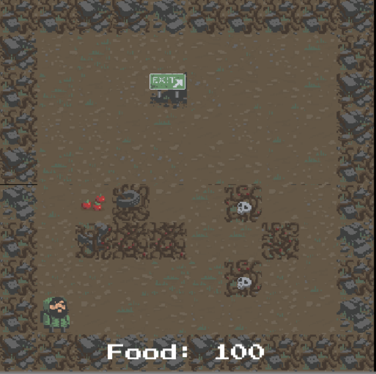

# EcsRx Roguelike 2D

This is a simple port of the unity roguelike 2d demo project, it has tried to stay as close to the original
unity example logic as possible but in some cases due to the paradigm or to make things simpler there 
may be some slight changes.

To find out more about the EcsRx framework go to:

- [EcsRx Repository](https://github.com/grofit/ecsrx)
- [EcsRx Gitter Chat](https://gitter.im/grofit/ecsrx?utm_source=badge&utm_medium=badge&utm_campaign=pr-badge&utm_content=badge)

## Running it?

- Clone the Repo
- Open in Unity
- Open the `Game/Scenes/game-scene` scene
- Press play

## How it works?

So it uses the EcsRx project and at a high level splits everything into Components and Systems, with some 
additional things like Blueprints, Events and ViewResolvers. (More info on these topics in the EcsRx repo).

So if you open up the `Game` folder, within there you can see the `AppContainer` entry point which the scene
uses to bootstrap everything, and the other data containers (Components, Events) and logic containers 
(Systems / Occasionally Blueprints). 

This is not a trivial example, so to find simpler examples for EcsRx check the main repo, however this shows
a real world use case and how things can hook together and react to events and changing data with reactive 
properties and other interesting approaches.

## Blurb

So this was just a quick port, it is unoptimised but runs well enough and although there are a few quirks
which will hopefully get ironed out at a later point, for all intents and purposes this is working and a good
example to get your head around more complex scenarios.